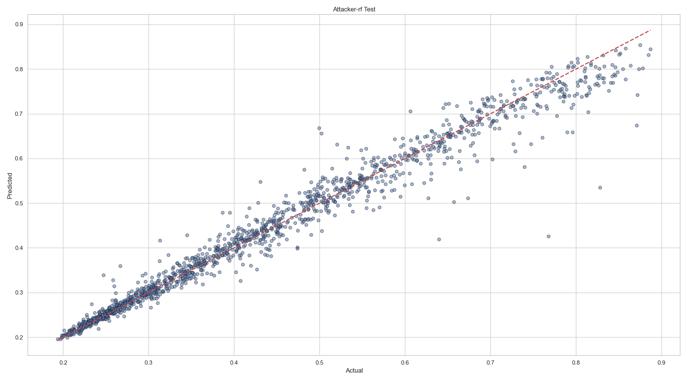
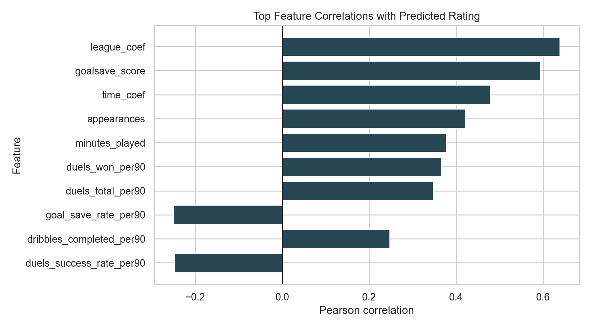
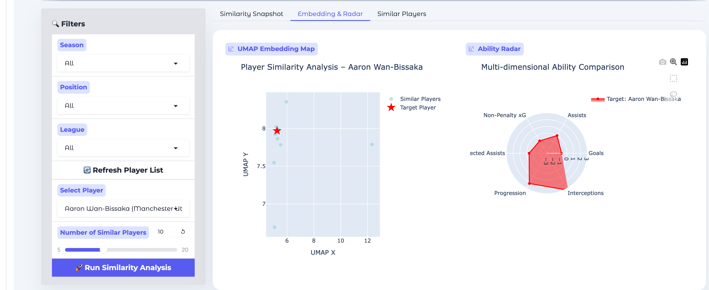
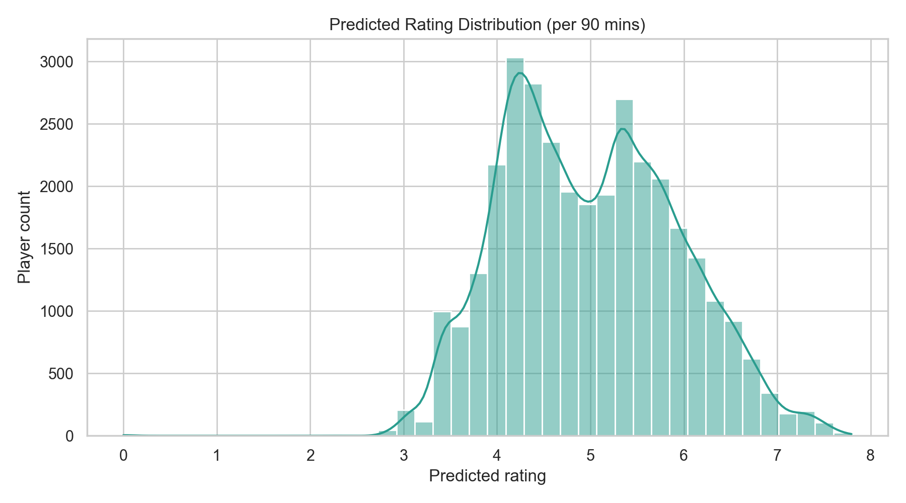
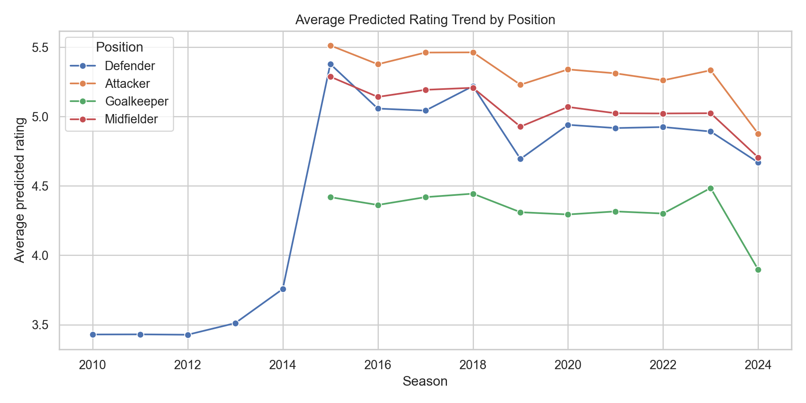

# Athlemetrics Model Blueprint (Public Extract)

> This document focuses on the core workflows of the scoring model and role clustering system, enabling users and contributors to understand model capabilities, scope of use, and visualization outputs. The descriptions cover public data, interpretable features, and example charts, excluding private weights or complete training scripts.

## 1. Data and Feature Pipeline
### 1.1 Data Sources
- `player_stats_per90`: Normalized to 90-minute scale from public league statistics (FBref, WhoScored, etc.), serving as the primary table for training `traindata.py`.
- `player_role_features.db`: Feature repository used by `feature_analysis.py` and `PlayerRole_Clustering.py`, containing `player_metadata`, high-dimensional feature matrices, and clustering coordinates.
- Season labels, leagues, positions, countries, and other metadata are reused in modeling and API endpoints to ensure ratings align with user-familiar dimensions.

### 1.2 Feature Engineering
`wgssport/per_90model/traindata.py` performs the following steps after reading `player_stats_per90`:
1. **Position Indicators**: `add_position_indicators` automatically generates one-hot features for the four major roles (Attacker/Midfielder/Defender/Goalkeeper), enabling the model to capture role differences.
2. **Derived Efficiency Features**: Examples include `goal_conversion_rate_per90`, `defensive_efficiency_per90`, `creativity_index_per90`, `duels_intensity_per90`, and other ratio or index-type features.
3. **Discipline and Physicality Indicators**: Such as `net_fouls_per90`, `card_ratio_per90`, `aggressiveness_index_per90`, balancing "effective aggression" with foul costs.
4. **Goalkeeper Extension Features**: Goalkeepers additionally receive high-weight fields like `goals_saves_per90`, `goal_save_rate_per90`.

### 1.3 Target Definition
- A unified `rating_per90` main label is generated via `criticmethod.create_player_rating` and `compute_role_based_rating`, while simultaneously outputting 9+ subscores such as `goals_score`, `tackles_score`, ensuring supervisory signals cover different capability dimensions.
- Rating interval maintained at 0–1 for convenient frontend mapping to 0–100 (Rating Demo, RapidAPI).

## 2. Training and Tuning Process
`traindata.py` independently trains three model suites (MLP, XGBoost, RandomForest) for each role, dumping the best grid search results (including `robust_scaler_per90.pkl`):

| Step | Description |
| --- | --- |
| Data Split | Within each role, first reserve 20% as test set, then split remaining 80% into 20% validation set for model/hyperparameter selection. |
| Robust Scaling | Use `RobustScaler` to mask outlier effects; scaler and model stored together in `rf_model_per90/<role>/`. |
| Grid Search | - **MLP**: `hidden_layer_sizes ∈ {(100,), (100,50), (200,100)}`, `alpha ∈ {1e-4,1e-3,1e-2}`, `learning_rate_init ∈ {1e-4,1e-3,1e-2}`; - **XGB**: `n_estimators ∈ {100,200}`, `max_depth ∈ {3,5}`, `learning_rate ∈ {0.01,0.1}`; - **RF**: `n_estimators ∈ {100,200}`, `max_depth ∈ {None,10,20}`, `min_samples_split ∈ {2,5}`. |
| Evaluation Metrics | Print/record RMSE, MSE, MAE, R², and generate prediction vs. actual, residual, distribution comparison and other visualizations (saved in `predict_data_result/visuals2/`). |
| Model Delivery | Use `joblib.dump` to store weights for each role × model, allowing API endpoint to select by `model` parameter (mlp/xgb/rf). |

*Figure: `predict_data_result/visuals2/Attacker_rf_pred_vs_actual_test.png` demonstrates the fit performance of Random Forest on the Attacker test set, with most samples clustered near the diagonal line.*

## 3. Feature Diagnostics and Interpretability
`fbref-databuilding/feature_analysis.py` provides analysis tools to ensure input features are stable and interpretable:

1. **Correlation Review**: Default threshold 0.8, lists highly correlated feature pairs, suggesting dimensionality reduction or regularization before training.
2. **Position-wise Discriminability**: Computes standardized variance within position samples, identifying the top 5 most distinctive features for roles like LW and DM.
3. **PCA Contribution Rate**: Outputs top 10 principal components and cumulative explained variance, quickly verifying whether "passing/progression/defense" three major abilities cover most variance.
4. **Clustering Quality Warm-up**: Iterates K=3–12, reports silhouette and Calinski-Harabasz scores to inform K selection for subsequent role clustering.
5. **t-SNE Position Separability**: Visualizes center distances of different primary positions in 2D embeddings, revealing natural overlaps like CB vs. FB.
6. **Optimization Suggestions**: Script outputs human-readable recommendation paragraphs (new ratio features, position-specific combined indicators, etc.).

## 4. Tactical Role Clustering System
`fbref-databuilding/PlayerRole_Clustering.py` runs multi-algorithm ensemble clustering on `player_role_features.db`:

1. **Position Coarse Grouping**: Maps by `primary_position` to FWD/MID/DEF/GK, removing groups with insufficient samples.
2. **Feature Standardization**: Apply `StandardScaler` to numeric columns, ensuring comparability across statistics.
3. **KMeans/GMM Tuning**: `tune_kmeans_clusters` selects optimal K via silhouette, `tune_gmm_components` selects components via BIC.
4. **Multi-Algorithm Cooperation**: Beyond KMeans/GMM, also runs hierarchical clustering, DBSCAN, UMAP+HDBSCAN, optionally using simple voting to generate `ensemble_labels`.
5. **Results Write-back**: Clustering labels stored in `player_role_clusters`, UMAP coordinates in `player_role_umap_embedding`, and based on `summarize_clusters` feature weights, generate `player_role_cluster_labels` for frontend display of descriptions like "creative winger / defensive midfielder".

*Figure: `predict_data_result/player_role_analysis/role-analysis-preview.png` shows the distribution of different role clusters on the UMAP plane, cross-validating with Rating Demo's similar player function.*

## 5. Online Performance and Example Visualizations
- **Rating Distribution**: `rating_per90` for all roles approximately follows normal distribution, concentrated in 0.45–0.75 range, with ultra-high scores (>0.85) identifying top consistent performers.

  

- **Season Trend**: `season_rating_trend.png` can display long-term trajectories for individual players and model sensitivity to performance fluctuations.

  

- **League/Position Overview**: `rating_by_position.png`, `league_average_rating.png` and similar charts display model's interpretable aggregated results, suitable for direct use in business or media reports.

- **Metrics Overview**: `predict_data_result/visuals2/metrics_*` heatmap series provide RMSE/MAE/R² comparisons across roles × models, typical performance ranges: 
  - R²: 0.70–0.82 (slightly higher for forwards, slightly lower for goalkeepers). 
  - RMSE: 0.07–0.11 (aligned with rating interval, corresponding to 7–11 points error in 0–100 scale).

- **Public Aggregate Metrics** (example):

| Role | MLP Metrics | XGB Metrics | RF Metrics |
| --- | --- | --- | --- |
| Attacker | RMSE 0.021 MAE 0.014 R² 0.985 | RMSE 0.023 | RMSE 0.029 |
| Midfielder | RMSE 0.020 R² 0.987 | RMSE 0.023 | RMSE 0.030 |
| Defender | RMSE 0.031 | RMSE 0.025 MAE 0.009 R² 0.979 | RMSE 0.026 |
| Goalkeeper | RMSE 0.033 | RMSE 0.022 R² 0.981 | RMSE 0.024 |

## 6. Versions and Delivery
- External version numbers follow `public-demo-YYYY-MM`, announced simultaneously in `API.md` and `DATA.md`.
- Each version update should document:
  1. Training data time range, publicly accessible `.db/.csv` download addresses;
  2. Adjustments to feature or clustering configuration (e.g., `duels_intensity_per90` addition, KMeans K value change);
  3. Online model hash and visualization snapshots for user verification.
- Models serve only as scoring and comparison references, not providing player trading or betting advice; products should prompt users that "the model is a result of public statistics calculation".

---
For more details, refer to `public-demo/API.md` for inference interface specifications and `DATA.md` for public data download methods.
